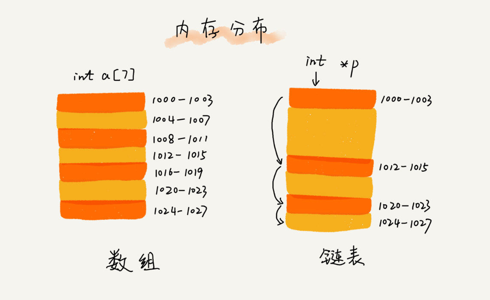
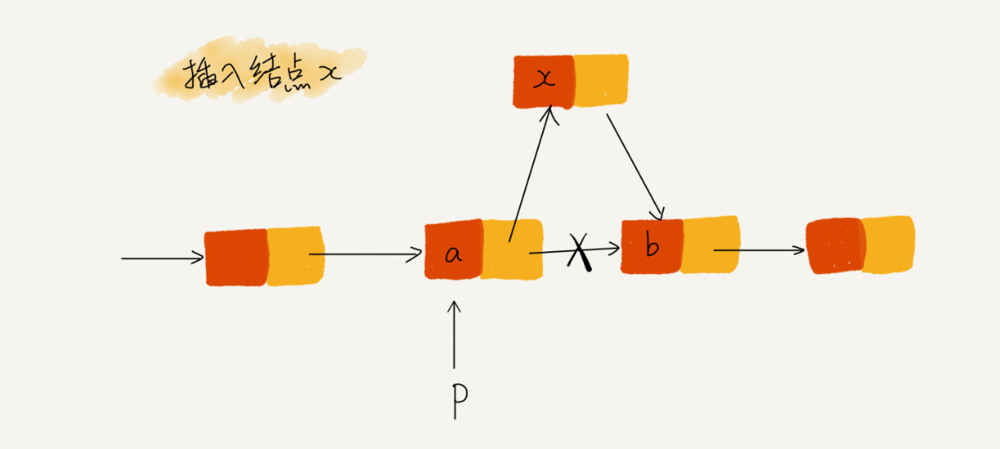

## 链表的基本说明

### 数组和链表的区别
从 底层的存储结构上来看

### 链表的插入和删除
常见的插入场景
- 在链表的某个指定结点前面插入一个结点

常见的删除场景
- 删除结点中 值等于某个给定值的结点
- 删除给定指针指向的结点

### LRU 算法的核心（使用单链表实现）
思路：
我们维护一个有序单链表，越靠近链表尾部的节点是越早之前访问的，当有一个新的数据被访问时，我们从链表
头开始顺序遍历链表。
1. 如果此数据之前已经被缓存在链表中了，我们遍历得到这个数据对应的结点，并将其从原来的位置删除，然后再
插入到链表的头部。
2. 如何此时数据没有在缓存表中，又可以分成为两种情况：
   - 如果此时缓存未满，则将此结点直接插入到链表的头部；
   - 如果此时缓存已满，则链表尾部结点删除，将新的数据结点插入到链表的头部。
    
这样我们就用单链表实现了一个 LRU 缓存了。现在我们来看下缓存访问的时间复杂度是多少，因为不管缓存有没有满
，我们都需要遍历一遍链表，所以这种基于链表的实现思路，缓存的访问的时间复杂度为 O(n)。

实际上，我们可以继续优化这个实现思路，比如引入散列表（Hash table）来记录每个数据的位置，将缓存访问
的时间复杂度降到 O(1)。

### 操作链表时的技巧
#### （一）理解指针或引用的含义

#### （二）警惕指针丢失和内存泄漏
当我么在插入结点时，一定要注意顺序，要先将结点 x 的 next 指针指向结点 b，再把结点 a 的 next 指针
指向结点 x，这样才不会丢失指针，导致内存泄漏

#### （三）

