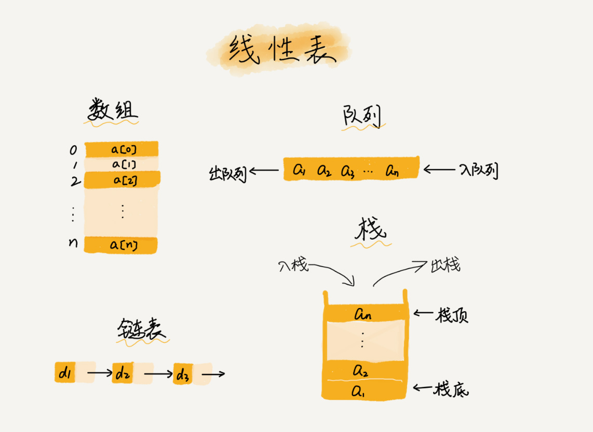
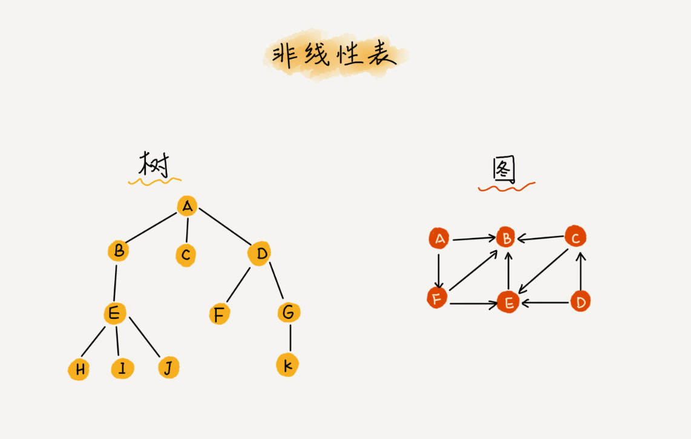
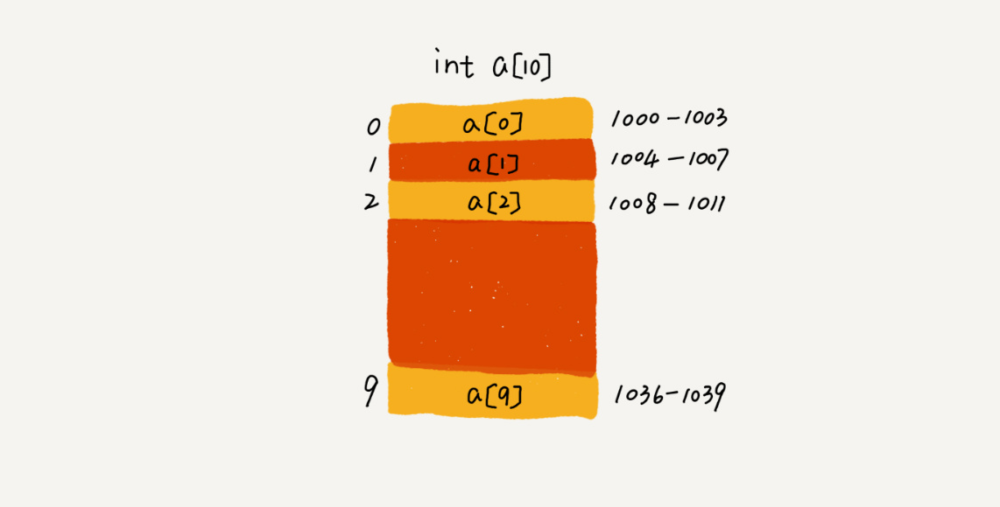

## 数组的基本说明

### 什么是数组？
数组（array）是一种线性表数据结构，它用一组连续的内存空间来存储一组具有相同类型的数据

### 什么是线性表？
线性表就是数据排成一条线一样的结构，每个线性表上的数据最多只有前和后两个方向，数组，链表，队列，
栈等也是线性表的结构



而与线性表对立的概念是非线性表，比如二叉树，堆，图等，之所以叫非线性，是因为，在非线性表中，
数据之间并不是简单的前后关系



### 数组为啥用连续的内存空间来存储相同类型的数据？
正是因为这两个限制，数组才有一个堪称杀手锏的特性：随机访问，但有利 就有弊，这两个限制也让
数组的很多操作变得非常低效，比如要想在数组中删除 ，插入一个数据，为了保证连续性，就需要做
大量的数据搬移工作。

### 数组如何实现根据下标随机访问数组元素？
我们拿一个长度为10的 int 类型的数组 `int[] a = new int[10]` 来举例 在我画的这个图中，
计算机给数组 a[10], 分配了一块连续内存空间 1000~1039 ,其中，内存块的首地址为 base_address = 1000.



我们知道，计算机会给每个内存单元分配一个地址，计算机通过地址来访问内存中的数据，当计算机需要随机
访问数组中的某个元素时，它会首先通过下面的寻址公式，计算出该元素存储的内存地址：
```shell
a[i]_address = base_address + i * data_type_sise
```
其中 data_type_size 表示数组中每个元素的大小。我们举的这个例子里，数组中存储的是 int 类型数据，所以
 data_type_size 就为4个字节

### 数组和链表的区别
链表适合插入，删除，时间复杂度 O(1)；数组支持随机访问，根据下标随机访问的时间复杂度为 O(1).

