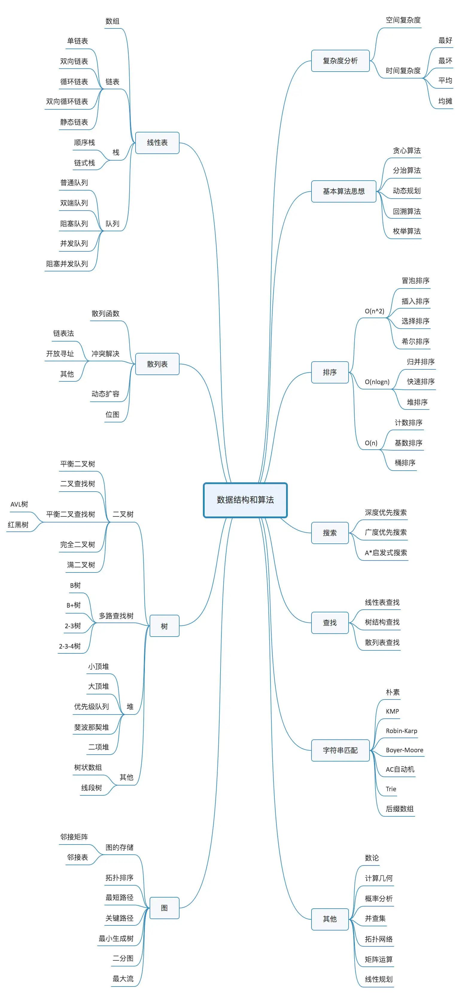

用`Golang`语言实现基本的数据结构的对应的算法

## 数据结构
golang内置数据结构
- 数组(Array)
- 切片(slice)
- 映射(Map)

> 从以下几个方面分析内置数据结构
> - 底层如何实现？
> - 如何使用？
> - 常见避坑指南

数据结构分类
- 线性表
- 散列表
- 树
- 图

其中以下为经常使用的数据结构
- 数组
- 链表
- 栈
- 队列
- 散列表
- 二叉树
- 堆
- 跳表
- 图
- Trie树

## 参考文献
极客时间 -- 《数据结构和算法之美》