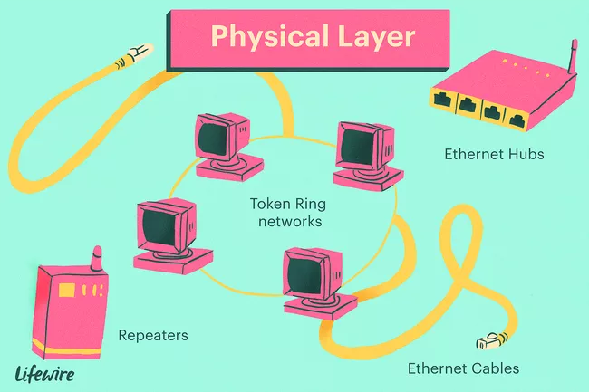
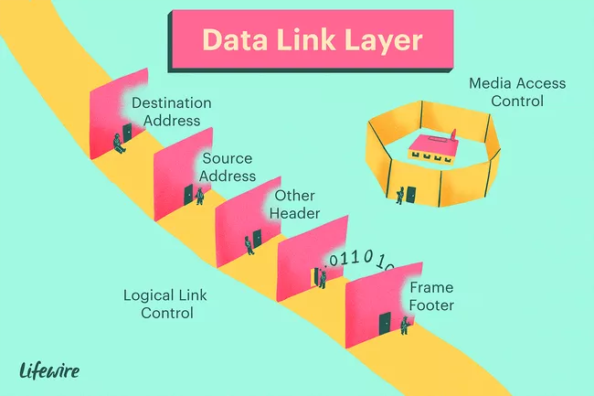
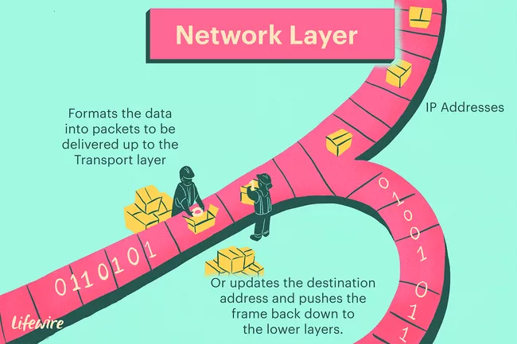
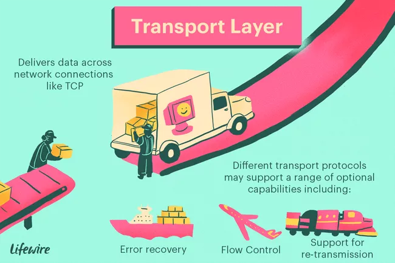
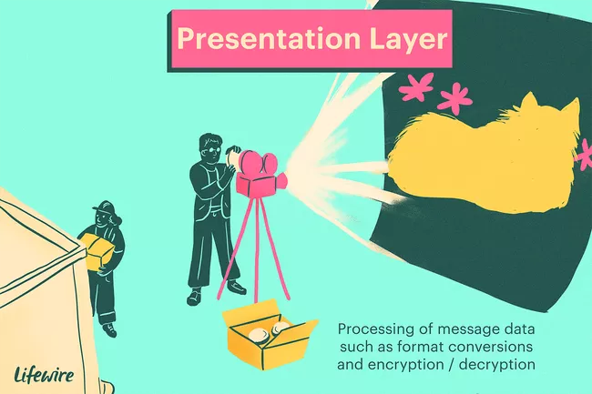

## OSI 模型的层的插图说明
原文链接（https://www.lifewire.com/layers-of-the-osi-model-illustrated-818017）

开放系统互连（OSI，Open Systems Interconnection）模型定义了用于图层中实现协议的网络框架，控制从一层传递到下一个层。
今天它主要被用作教学工具。它在逻辑进展中概念性地将计算机网络架构分为7层。

较低层处理电子信号，二进制数据块以及这些数据再网络中的路由。更高的层包括从用户的角度来看网络请求和响应，
数据表示和网络协议。

OSI 模型最初被认为是建立网络系统的标准架构，而今天许多流行的网络技术反映了 OSI 的分层设计。

### 物理层（Physical Layer）
在第一层，OSI 模型的物理层负责最终将数据位从发送（源）设备的物理层通过网络通信媒体传输到接受（目的）设备的物理层。

第一层技术的例子包括以太网电缆和集线器，此外，集线器和其他中继器是物理层工作的标准网络设备，就是电缆连接器一样。

在物理层，数据通过物理介质支持的信号类型传输：电压，无线电频率或红外光或普通光的脉冲。

### 数据链路层（Data Link Layer）
当从物理层获取数据时，数据链路层检查物理传输错误和包中的数据帧。数据链路层还管理以太网网络的物理寻址方案，例如 MAC 地址，
控制网络设备到物理介质的访问。

由于数据链路层是 OSI 模型中最复杂的层，所以它通常被分成两部分：媒体访问控制（MAC）子层和逻辑链路控制子层。

### 网络层（Network Layer）
网络层在数据链路层之上增加了路由的概念，当数据达到网络层时，每一帧中包含的源地址和目的地址将被检查，以确定数据是否可以到达最终目的地。
如果数据可以到达最终目的地，第三层将数据格式化为数据包，并交付给传输层，否则，网络层更新目的地址并将帧下推到较低的层。

为了支持路由，网络层维护网络上设备的逻辑地址，例如 IP 地址，网络层还管理这些逻辑地址和物理地址之间的映射。
在 IPv4 网络中通过地址解析协议（ARP,Address Resolution Protocol）完成此映射，IPv6 网络中使用邻居发现协议（NDP,Neighbor Discovery Protocol）。

### 传输层（Transport Layer）
传输层通过网络连接传递数据。TCP（Transmission Control Protocol） 和 UDP（User Datagram Protocol）是传输层网络协议中最常见的例子。
不同的传输协议可以支持一系列可选功能，包括错误恢复，流量控制和对重传的支持。

### 会话层（Session Layer）
会话层管理发起和断开网络连接的事件的顺序和流，在第五层被构建成支持可以动态创建多种类型的连接，并以各个网络运行。

### 表现层（Presentation Layer）
表现层具有任何 OSI 模型的最简单功能，在第六层，它处理消息数据的语法处理，例如支持在其上方的应用层所需的格式转换和加密/解密。

### 应用层（Application Layer）
应用层将网络服务提供给最终用户应用程序。网络服务是与用户数据合作的协议，例如，在 Web 浏览器应用程序中，
应用程序层协议 HTTP 打包发送和接受网页内容所需的数据。第七层向表现层提供数据（同时从表现层获取数据）。

