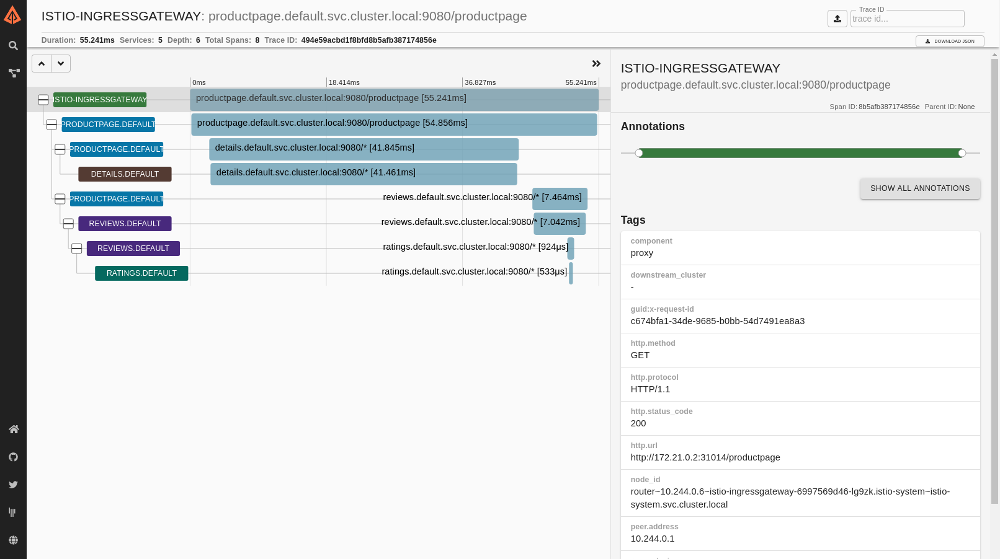

# 可观察性
Istio 为网格内所有服务通信生成了详细的遥测数据，这种遥测数据提供了服务行为的可观察性，使操作员能够对他们的应用程序进行故障排除，维护和优化
- 而不会给服务开发人员带来任何额外的负担。通过 Istio，操作员可以全面了解受监控的服务如何与其他服务以及 Istio 组件本身进行交互。

Istio 生成以下类型的遥测数据以提供整体服务网格的可观察性：
- 指标：Istio 根据监控的四个"黄金信号"（延迟，流量，错误和饱和度）生成一组服务指标。Istio 还提供了网格控制平面的详细指标。
还提供了基于这些指标构建的默认网格监控仪表盘。
- 分布式追踪：Istio 为每个服务生成分布式跟踪跨度，让操作员详细了解网格内的调用流和服务依赖关系。
- 访问日志：当流量流入网格内的服务时，Istio 可以生成每个请求的完整记录，包括源和目标元数据。此信息使操作员能够审计服务行为，
下沉到单个工作负载实例级别。

## 指标
指标提供了一种监控和理解总体行为的方法。

为了监控服务行为，Istio 为服务网格内的流量，流出和流入流量生成指标。这些指标提供了有关行为的信息，例如总流量，流量中的错误率和请求的响应时间。

除了监控网格内服务的行为外，监控网格本身的行为也很重要。Istio 组件导出了有关自身内部行为的指标，以提供网格控制平面的健康状况和功能洞察。

### 代理级指标
Istio 指标收集从 sidecar 代理（Envoy）开始。每个代理都会生成一组关于通过代理的所有流量（入站和出站）的丰富指标。
代理还提供有关代理本身管理功能的详细统计信息，包括配置和健康信息。

Envoy 生成的指标以 Envoy 资源（例如侦听器和集群）的粒度提供对网格的监控。因此，需要了解网格服务和 Envoy 资源之间的连接来监控 Envoy 指标。

Istio 使操作员能够选择在每个工作负载实例中生成和收集那些 Envoy 指标。默认情况下，Istio 仅启用 Envoy 生成的统计信息的一小部分，
以避免使指标后端不堪重负，并减少与指标收集相关的 CPU 开销。但是，操作员可以在需要时轻松扩展收集的代理指标集。这可以对网络行为进行有针对性的调试，
同时降低整个网格的监控总成本。

Envoy 文档站点包含对 Envoy 统计数据收集的详细概述。Envoy Statistics 的操作指南提供了有关控制代理级别指标生成的更多信息。

代理级指标示例：
```shell
envoy_cluster_internal_upstream_rq{response_code_class="2xx",cluster_name="xds-grpc"} 7163

envoy_cluster_upstream_rq_completed{cluster_name="xds-grpc"} 7164

envoy_cluster_ssl_connection_error{cluster_name="xds-grpc"} 0

envoy_cluster_lb_subsets_removed{cluster_name="xds-grpc"} 0

envoy_cluster_internal_upstream_rq{response_code="503",cluster_name="xds-grpc"} 1
```

### 服务级指标
除了代理级别的指标，Istio 还提供了一组面向服务的指标，用于监控服务通信。这些指标涵盖了四个基本的服务监控需求：延迟，流量，错误率和饱和度。
Istio 附带一组默认仪表板，用于根据这些指标监控服务行为。

默认情况下，标准 Istio 指标会导出到 Prometheus。

服务级别指标的使用完全是可选的。操作者可以选择关闭这些指标的生成和收集以满足他们的个人需求。

服务级指标示例：
```shell
istio_requests_total{
  connection_security_policy="mutual_tls",
  destination_app="details",
  destination_canonical_service="details",
  destination_canonical_revision="v1",
  destination_principal="cluster.local/ns/default/sa/default",
  destination_service="details.default.svc.cluster.local",
  destination_service_name="details",
  destination_service_namespace="default",
  destination_version="v1",
  destination_workload="details-v1",
  destination_workload_namespace="default",
  reporter="destination",
  request_protocol="http",
  response_code="200",
  response_flags="-",
  source_app="productpage",
  source_canonical_service="productpage",
  source_canonical_revision="v1",
  source_principal="cluster.local/ns/default/sa/default",
  source_version="v1",
  source_workload="productpage-v1",
  source_workload_namespace="default"
} 214
```

### 控制面指标
Istio 控制平面还提供了一组自我监控指标。这些指标允许监控 Istio 本身行为（与网格中的服务行为不同）。

## 分布式追踪
分布式追踪提供了一种通过监视流经网格的单个请求来监视和理解行为的方法。跟踪是网格操作员能够了解服务依赖项和服务网格内的延迟来源。

Istio 支持通过 Envoy 代理进行分布式跟踪。代理代表它们代理的应用程序自动生成跟踪跨度，只需要应用程序转发适当的请求上下文。

Istio 支持许多跟踪后端，包括 Zipkin，Jaeger，Lightstep 和 Datadog。操作员控制跟踪生成的采样率（即每个请求生成跟踪数据的速率）。
这允许操作员控制为其网格生成的跟踪数据的数量和速率。

Istio 为单个请求生成的分布式追踪示例：


## 访问日志
访问日志提供了一种从单个工作负载实例的角度监视和理解行为的方法。

Istio 可以以一组可配置的格式为服务流量生成访问日志，让操作者可以完全控制日志记录的方式，内容，时间和地点。
更多信息请参考获取 Envoy 的访问日志。

Istio 访问日志示例：
```shell
[2019-03-06T09:31:27.360Z] "GET /status/418 HTTP/1.1" 418 - "-" 0 135 5 2 "-" "curl/7.60.0" "d209e46f-9ed5-9b61-bbdd-43e22662702a" "httpbin:8000" "127.0.0.1:80" inbound|8000|http|httpbin.default.svc.cluster.local - 172.30.146.73:80 172.30.146.82:38618 outbound_.8000_._.httpbin.default.svc.cluster.local
```